# NKU2024-Computer-Graphics

渲染框架代码来自于 `https://gitee.com/nankaigraphics/nrenderer.git`

# 环境配置

+ 操作系统: `Windows 10`
+ 编译器: `MSVC(Visual Studio 2019)`
+ `Opengl 3.3` 以上
+ `CMake 3.18`以上

# 编译说明

1. 打开`./code`所在文件夹->右键->使用`Visual Studio`打开
2. 项目->生成CMake缓存

    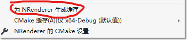
3. 生成->全部重新生成

    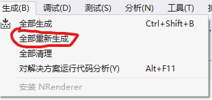
4. 选择启动项

    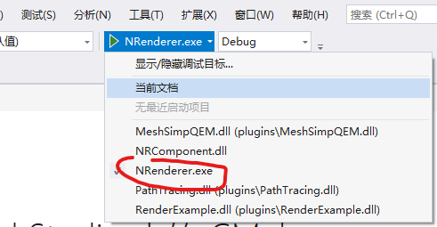

# 使用方法

## 导入场景文件

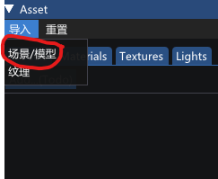

## 修改材质信息

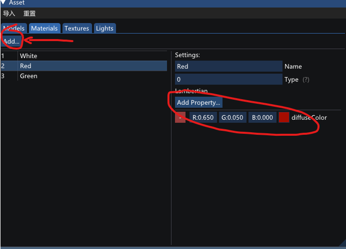

## 修改场景参数

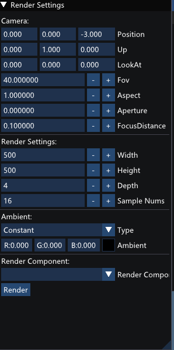

## 选择渲染方法并渲染

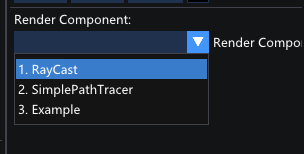

## 切换渲染结果/快速预览

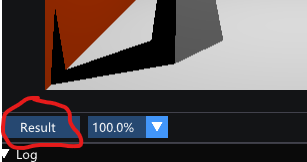

# 渲染算法

## Ray Cast

向场景中投射光线, 计算直接光照. 计算方法为(Phong, 忽略了环境光)
$$
L_o = k_d\cdot Li + k_s\cdot Li(V \cdot R)^p
$$

场景文件为 `ray_cast_cornel.scn`

渲染结果:
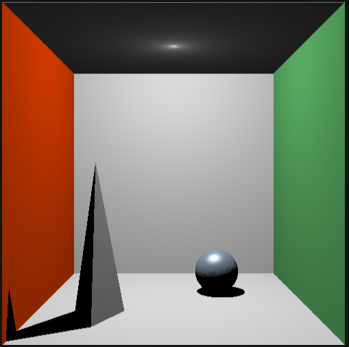

## Simple Path Tracer

使用Monte Carlo方法计算光照, 不支持网格, 仅支持漫反射材质

场景文件`path_tracing_cornel.scn`

渲染结果(采样数2048)
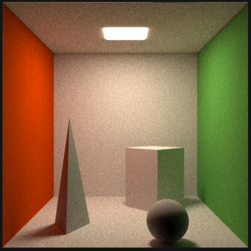

## 改进重要性采样算法后的Simple Path Tracer

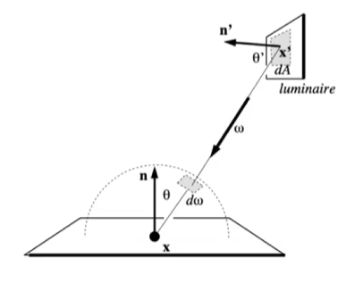

通过直接光照叠加间接光照的方式提升了Simple Path Tracer的渲染速度.同等渲染质量下的渲染时间提升了60%

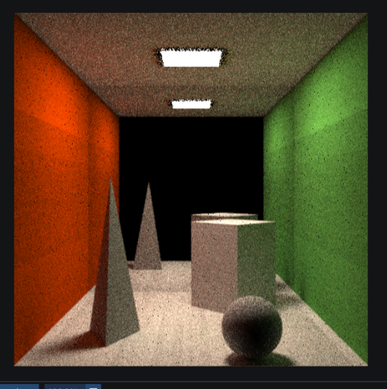

## 光子映射算法实现核心渲染方法

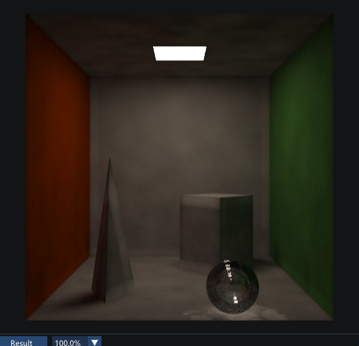

全局光子图 20000 光子，焦散光子图 5000光子的渲染效果，相较光线追踪算法，同等效果下的渲染速度提升 2 倍
